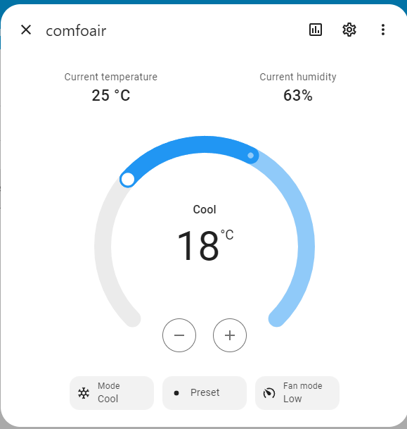

Need help? Join the [Discord](https://discord.gg/dUSSRezJXC) or open an issue.

# Comfoair Q 350 ESPHome bridge

This software let you use a ESP32 + CAN Transceiver to interact with the Comfoair Q 350 unit.

It does expose all known informations of your Comfoair unit via ESPHOME and let you control the air flow via Home Assistant as well.

It does allow you to integrate the unit on Home Assistant as depicted below:


## Custom PCB

Inside the [docs/pcb folder](docs/pcb) you can find both gerber file and BOM. Files are provided as is. It's up to you to check data and schematic correctness.

This repository is meant to be working with the custom pcb above. But you can always buy components separately such as [Waveshare SN65HVD230](https://www.banggood.com/Waveshare-SN65HVD230-CAN-Bus-Module-Communication-CAN-Bus-Transceiver-Development-Board-p-1693712.html?rmmds=myorder&cur_warehouse=CN) and a voltage regulator as well as an ESP32 of your choice and it will work.

The pcb will look like this once soldered and mounted.


## DIY

Prerequisites for custom build:

* `ESP32` -> [link](https://amzn.to/3pe0XVP)
* `DC-DC converter` -> [link](https://amzn.to/39ar22v)
* `RJ45 Female` -> [link](https://amzn.to/3sNx3tH)
* `Can Transceiver` -> [Waveshare SN65HVD230](https://www.banggood.com/Waveshare-SN65HVD230-CAN-Bus-Module-Communication-CAN-Bus-Transceiver-Development-Board-p-1693712.html?rmmds=myorder&cur_warehouse=CN)
+ Some ethernet cable


Here a simple schematic. made by @mat3u

```
---------------+        +---------------+                 +-------------+
(oran/red)12V  o--------o IN+      OUT+ o-----------------o VIN         |
               |        |   [LM2596S]   |                 |             |
(brown)   GND  o--------o IN-      OUT- o-----------------o GND         |
               |        +---------------+                 |             |
    [RJ45]     |                                          |   [ESP32]   |
  [ComfoAir]   |                                          |             |
               |        +-------------------------+       |             |
(w/blue) CAN_L o--------o CAN_L               3v3 o-------o 3v3         |
(blue)   CAN_H o--------o CAN_H               GND o-------o GND         |
---------------+        |                         |       |             |
                        |   [SN65HVD230]   CAN TX o-------o 25          |
                        |                  CAN RX o-------o 21          |
                        +-------------------------+       +-------------+
``````

## esphome conf

To include this repo use the external_components configuration like so:

```yaml
# ...
external_components:
  - source: github://vekexasia/comfoair-esp32
    components: [ comfoair ]

comfoair:

# ...
```


# Home Assistant Services

The component exposes 4 services.

- comfoair_send_command
- comfoair_send_hex
- comfoair_update_all
- comfoair_req_update_service

**NOTE**: the prefix could differ depending on your esphome device name.

**comfoair_send_command**: allows one "command" parameter. The value of the param can be one of the following pre-bundled commands:

- ventilation_level_0
- ventilation_level_1
- ventilation_level_2
- ventilation_level_3
- boost_10_min
- boost_20_min
- boost_30_min
- boost_60_min
- boost_end
- auto
- manual
- bypass_activate_1h
- bypass_deactivate_1h
- bypass_auto
- ventilation_supply_only
- ventilation_supply_only_reset
- ventilation_extract_only
- ventilation_extract_only_reset
- temp_profile_normal
- temp_profile_cool
- temp_profile_warm

In case you need more flexibility you can use the `comfoair_send_hex` service like follows:
```
service: esphome.comfoair_send_hex
data:
  hexSequence: "8415070100000000100e000000"
```
^^ the above is equivalent to ventilation_extract_only (which has an inner timer of 1h)

**comfoair_update_all**: this service will request an update of all the values from the Comfoair unit. This is useful in case you want to force an update of all the values.

**comfoair_req_update_service**: this service will request an update of a specific value from the Comfoair unit. This is useful in case you want to force an update of a specific value. You're required to pass the `PDOID` of the service to update

## Climate Entity

The component will expose a climate entity with heat,cool,auto modes and all the fan speeds.

Furthermore current indoor humidity and temperature as well as current target temperature will be shon as in the picture below.




The climate entity can also be used to set the fan speed, and the mode (heat, cool, auto).

## Global filters

Since this component posts data as soon as it receives it, sometimes it might be useful to avoid spamming home assistant with updates.

To avoid this, you can set the `global_filters`. This accepts the same filters as the `filters` parameter in the `sensor` component.

For example, let's say you want to throttle the sensors for 10s.

```yaml

comfoair:
  global_filters:
    - throttle: 10s
```

Obviously, you can always set the filter on a per-sensor basis.

```yaml
comfoair:
  supply_fan_speed:
    name: supply_fan_speed
    disabled_by_default: false
    force_update: false
    unit_of_measurement: rpm
    accuracy_decimals: 0
    filters:
      - or:
          - throttle: 300s
          - delta: 100.0
```

**NOTE**: when setting `global_filters` that **does** takes precedence over the `filters` set on a per-sensor basis.
## Credits

A lot of this repo was inspired by the reverse engineering [here](https://github.com/marco-hoyer/zcan/issues/1).
If you'd like to know more how the unit communicates, head over

* [here](https://github.com/michaelarnauts/aiocomfoconnect/blob/master/docs/PROTOCOL-RMI.md)
* [and here](https://github.com/michaelarnauts/aiocomfoconnect/blob/master/docs/PROTOCOL-PDO.md)

